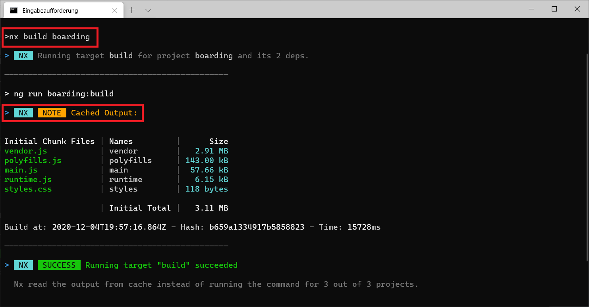
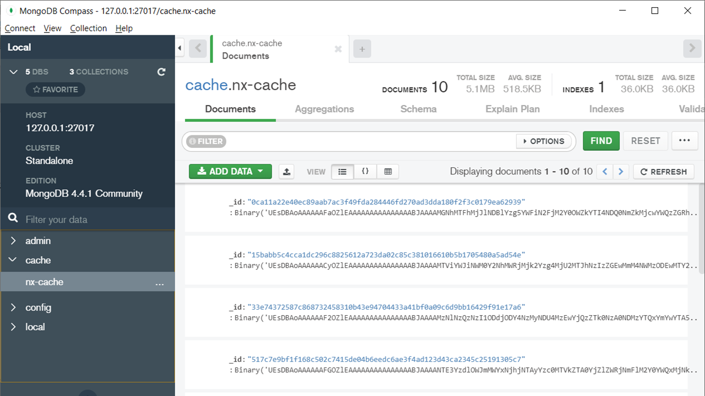

# Incremental Builds to Speed up Your CI Process

Having a huge solution leads to increased build times. This is a burden for many teams. To deal with this situation, Nx provides a great feature: Incremental Builds and Tests. That means, that only the changed libraries are rebuilt and retested in terms of unit and e2e tests.

<!-- ## Using Incremental Builds -->

To make use of incremental builds, make sure you create your libs with the ``--buildable`` or ``--publishable`` flag. The latter one is only needed if you plan to publish your libraries to an NPM registry. In all other cases go with ``--buildable`` because its faster:

```
ng g lib my-lib --buildable
```

For incremental builds, you need the Nx CLI. Install it via your package manager:

```
npm i -g @nrwl/cli
```

Then call ``nx build`` with the ``with-deps`` switch:

```
nx build my-app --with-deps
```

This new switch compiles your libraries separately so that the individual libraries and applications can be cached. If you repeat this command, just the changed libraries are rebuilt -- the rest is taken out of your cache. Obviously, this speeds up your whole build:



The same is done for executing unit tests (``nx test``), e2e tests (``nx e2e``), and linting (``nx lint``). The ``nx.json`` in your project's root defines, which of those tasks use the cache:

```json
"tasksRunnerOptions": {
    "default": {
        "runner": "@nrwl/workspace/tasks-runners/default",
        "options": {
        "cacheableOperations": ["build", "lint", "test", "e2e"]
        }
    }
},
```

By default, the cache is on for all of them. If you wonder where to find the cache, have a look to your ``node_modules/.cache/nx`` directory.

<!-- ## Using a Distributed Build Cache -->

If you want further speed up your whole build and CI process, you can use a distributed build cache. In this case you can benefit from tasks your colleagues already executed. Nothing needs to be done more than once within the whole team.

The smart people behind Nx provide an official solution for this called **Nx Cloud**. 

<!-- 
Besides this, you can also implement your own cache. This is exactly what the open source project [@apployees-nx/level-task-runner](https://www.npmjs.com/package/@apployees-nx/level-task-runner) does. It allows using several databases for caching. I've successfully used it with mongoDB, Redis, PostgreSQL, and MySQL. However, please keep in mind that this is an **unofficial** solution that might be affected by breaking changes in the future. Also, Nx Cloud provides some **further features** like a cool dashboard.

Here, I'm showing how to use ``@apployees-nx/level-task-runner`` together with a **mongoDB**. For this, you need to install ``@apployees-nx/level-task-runner`` and the mongoDB driver:

```
npm install @apployees-nx/level-task-runner -D
npm install mongodown -D
```

Then, you can adjust your ``taskRunnerOptions`` within ``nx.json`` to use the installed task running together with your mongoDB:

```json
"tasksRunnerOptions": {
    "default": {
        "runner": "@apployees-nx/level-task-runner",
        "options": {
            "cacheableOperations": ["build", "test", "lint", "e2e"],
            "levelTaskRunnerOptions": {
                "driver": "mongodown",
                "host": "127.0.0.1",
                "port": 27017,
                "name": "cache",
                "collection": "nx-cache"
            }
        }
    }
},
```

After calling ``nx build my-app --with-deps`` you find several key/values pairs in the defined mongoDB collection:


The keys are the hash values of all the files in a given library and the values are the cached build, test, or linting results:


-->