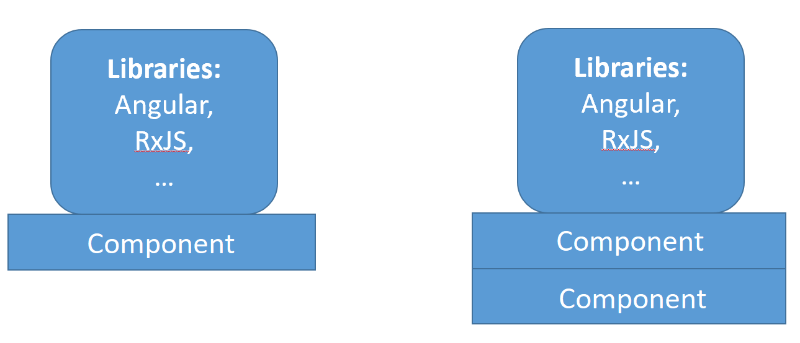
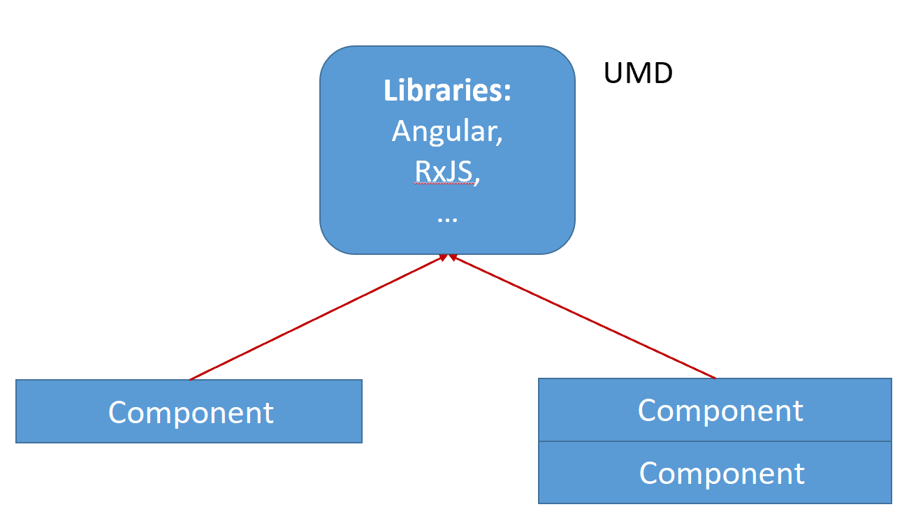

# Six Steps to your Angular-based Microfrontend Shell

As discussed in the last chapter, there are several approaches to implementing SPA-based microfrontends.

This chapter shows how to implement a microfrontend in six steps: A shell loading microfrontends on demand. Other than in the chapter about microfrontends and web components, I don't use web components for the macroarchitecture. I use ordinary SPAs which are loaded and bootstrapped on demand. I do use web components for the microarchitecture.


While this decision simplifies the implementation, we can still isolate different applications using shadow DOM. Angular has supported this web components standard for traditional Angular components since day one.

The case study loads a simple ``client-a`` and ``client-b`` into the shell. The former shares a widget with the latter:


You can find the [source code](https://github.com/manfredsteyer/angular-microfrontend) for this in my [GitHub account here](https://github.com/manfredsteyer/angular-microfrontend).

## Step 0: Make sure you need it

Make sure this approach fits your architectural goals. As discussed in the previous chapter, microfrontends have many consequences. Make sure you are aware of them.

## Step 1: Implement Your SPAs

Implement your microfrontends as ordinary Angular applications. In a microservice architecture, it's quite common that every part gets an individual repository to decouple them as much as possible (see [Componentization via Services](https://martinfowler.com/chapters/microservices.html#ComponentizationViaServices)) I've seen a lot of microfrontends based upon monorepos for practical reasons.

Of course, we could discuss when the term microfrontend is appropriate. More important is to find an architecture that fits your goals and to be aware of its consequences.

If we use a monorepo, we have to ensure, e.g. with linting rules, not to couple the microfrontends with each other. As discussed in a previous chapter, [Nrwl's Nx](https://nx.dev/angular) provides an excellent solution for that: It enables restrictions defining which libraries can access each other. Nx can detect which parts of your monorepo are affected by a change and only recompile and retest those.

To make routing across microfrontends easier, it's a good idea to prefix all the routes with the application's name. In the following case, the application name is ``client-a``

```TypeScript
@NgModule({
  imports: [
    ReactiveFormsModule,
    BrowserModule,
    RouterModule.forRoot([
      { path: 'client-a/page1', component: Page1Component },
      { path: 'client-a/page2', component: Page2Component },
      { path: '**', component: EmptyComponent}
    ], { useHash: true })
  ],
  [...] 
})
export class AppModule {
  [...]
}
```

## Step 2: Expose Shared Widgets

Expose widgets you want to share as web components/custom elements. Please note that from the perspective of microservices, you should minimise code sharing between microfrontends as it causes coupling in this architecture.

To expose an angular component as a custom element, you can use Angular elements. Take a look at my blogposts about [Angular Elements](https://www.softwarearchitekt.at/aktuelles/angular-elements-part-i/) and [lazy and external Angular Elements](https://www.softwarearchitekt.at/aktuelles/angular-elements-part-ii/).

## Step 3: Compile your SPAs

Webpack, and hence the Angular CLI, use a global array for registering bundles. It enables different (lazy) chunks of your application to find each other. However, if we load several SPAs into one page, they compete over this array, mess it up, and stop working.

We have two solutions:

1. Put everything into one bundle, so that this global array is not needed
2. Rename the global array

I use solution 1) because a microfrontend is, by definition, small. Just having one bundle makes loading it on demand easier. As we will see later, we can share libraries like RxJS or Angular itself between them.

To tweak the CLI to produce one bundle, I use my free tool [ngx-build-plus](https://www.npmjs.com/package/ngx-build-plus) which provides a ``--single-bundle`` switch:

```
ng add ngx-build-plus
ng build --prod --single-bundle
```

Within a monorepo, you have to provide the project in question:

```
ng add ngx-build-plus --project myProject
ng build --prod --single-bundle --project myProject
```


## Step 4: Create a shell and load the bundles on demand

Loading the bundles on demand is straightforward. All you need is some vanilla JavaScript code to dynamically create a ``script`` tag and the tag for application's root element:

```javascript
// add script tag
const script = document.createElement('script');
script.src = '[...]/client-a/main.js';
document.body.appendChild(script);

// add app
const frontend = document.createElement('client-a');
const content = document.getElementById('content');
content.appendChild(frontend);
```

Of course, you can also wrap this into a directive. 

You need some code to show and hide the loaded microfrontend on-demand:

```javascript
frontend['visible'] = false;
```

## Step 5: Communication Between Microfrontends

In general, we should minimise communication between microfrontends, as it couples them
. 

We have several options to implement communication. I used the least obtrusive one here: the query string. This approach has several advantages:


1. It is irrelevant which order the microfrontends are loaded. When loaded they can grab the current parameters from the URL
2. It allows deep linking
3. It's how the web is supposed to work
4. It's easy to implement

Setting a URL parameter with the Angular router is a simple matter of calling one method:

```typescript
this.router.navigate(['.'], { 
  queryParamsHandling: 'merge', queryParams: { id: 17 }});
```

The ``merge`` option saves the existing URL parameters. If there is already an ``id`` parameter, the router overwrites it.

The Angular router can help listen for changes within URL parameters:

```TypeScript
route.queryParams.subscribe(params => {
    console.debug('params', params);
});
```

There are some alternatives:

1. If you wrap your microfrontends into web components, you can use their properties and events to communicate with the shell.
2. The shell can put a "message bus" into the global namespace:
    ```typescript
    (window as any).messageBus = new BehaviorSubject<MicroFrontendEvent>(null);
    ```

    The shell and the microfrontends can subscribe to this message bus and listen for specific events. Both can emit events. 
3. Using custom events provided by the browser:
    ```typescript
    // Sender
    const customer = { id: 17, ... };
    window.raiseEvent(new CustomEvent('CustomerSelected', {details: customer}))

    // Receiver
    window.addEventListener('CustomerSelected', (e) => { ... })
    ```

## Step 6: Sharing Libraries Between Microfrontends

As we have several self-contained microfrontends, each has its dependencies, e.g. Angular itself or RxJS. From a microservice perspective, this is perfect as it allows each microfrontend team to choose any library or framework and any version. They can even decide if and when to update to newer versions.  

However, from the perspective of performance and loading time, this structure is less appealing as it leads to code duplication within the bundles. For instance, you could end up with a specific angular version in several bundles:



Fortunately, there is a solution: Webpack externals.

Externals allow us to share libraries by loading them into the global namespace. This approach was popular in the days of jQuery (which provided a global $ object) and is still sometimes done for simple react and vue applications.

We can use UMD bundles for most libraries. Simply tell webpack not to bundle them together with every microfrontend, but rather to reference it within the global namespace:



To use webpack externals together with the Angular CLI, you can leverage [ngx-build-plus](https://www.npmjs.com/package/ngx-build-plus) which even comes with a schematic introducing the needed changes into your application.

As mentioned above, you can install it with ``ng add``:

```
ng add ngx-build-plus
```

Then, call the following schematic:

```
ng g ngx-build-plus:externals
```

Please remember that within a monorepo you have to provide the name of the project in question:

```
ng add ngx-build-plus --project myProject
ng g ngx-build-plus:externals --project myProject
```

This approach also introduces an npm script ``build:<project-name>:externals``. For the default project, there is a script ``build:externals`` too.

If you look into the ``index.html`` after running this script, you see that Angular is directly loaded:

```html
<!-- Angular Packages -->
<script src="./assets/core/bundles/core.umd.js"></script>
<script src="./assets/common/bundles/common.umd.js"></script>
<script src="./assets/common/bundles/common-http.umd.js"></script>
<script src="./assets/elements/bundles/elements.umd.js"></script>

<script src="./assets/forms/bundles/forms.umd.js"></script>
<script src="./assets/router/bundles/router.umd.js"></script>
```

To optimise this, one could put those parts of Angular into one bundle.

If you look into the generated ``webpack.externals.js``, you find a section mapping package names to global variables:

```javascript
const webpack = require('webpack');

module.exports = {
    "externals": {
        "rxjs": "rxjs",
        "@angular/core": "ng.core",
        "@angular/common": "ng.common",
        "@angular/common/http": "ng.common.http",
        "@angular/platform-browser": "ng.platformBrowser",
        "@angular/platform-browser-dynamic": "ng.platformBrowserDynamic",
        "@angular/compiler": "ng.compiler",
        "@angular/elements": "ng.elements",
        "@angular/router": "ng.router",
        "@angular/forms": "ng.forms"
    }
}
```

This method, for instance, makes the produced bundle reference the global variable ``ng.core`` when it needs ``@angular/core``. Hence, ``@angular/core`` no longer needs to be in the bundle.

Please note that this is not the default operation mode for Angular and has some risks.

## Conclusion

With the right wrinkles, implementing a shell for microelements is not difficult. However, this is only one approach to implementing microfrontends and has advantages and disadvantages. Before implementing it, make sure it fits your architectural goals.

