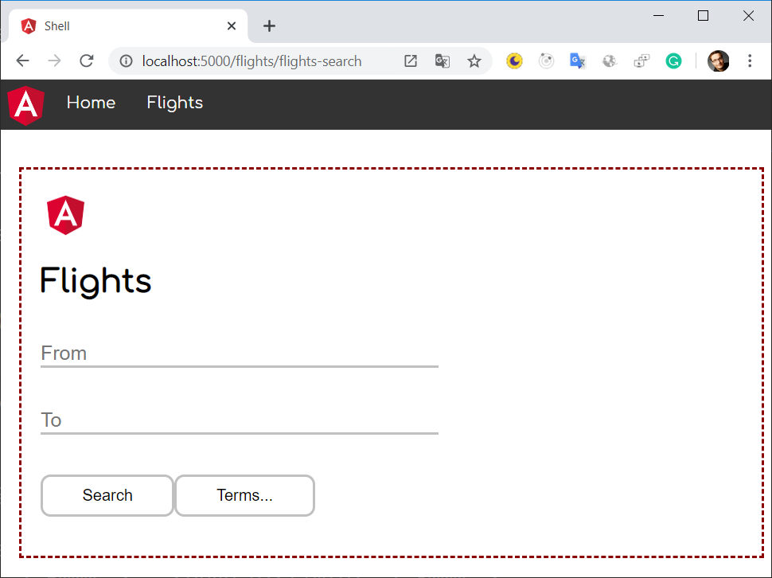
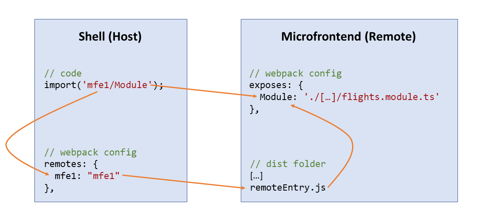

# The Microfrontend Revolution: Using Module Federation with Angular 

Until now, when implementing microfrontends, you had to dig a little into the bag of tricks. One reason is surely that current build tools and frameworks do not know this concept. Webpack 5, which is currently in BETA, will initiate a change of course here.

It allows an approach implemented by the webpack contributor Zack Jackson. It's called Module Federation and allows referencing program parts not yet known at compile time. These can be self-compiled microfrontends. In addition, the individual program parts can share libraries with each other, so that the individual bundles do not contain any duplicates.

In this chapter, I will show how to use Module Federation using a simple example.

## Example

The example used here consists of a shell, which is able to load individual, separately provided microfrontends if required:



The loaded microfrontend is shown within the red dashed border. Also, the microfrontend can be used without the shell:


The [source code](https://github.com/manfredsteyer/module-federation-with-angular) of the used example  can be found in my [GitHub account](https://github.com/manfredsteyer/module-federation-with-angular).


## The Shell (aka Host)

Let's start with the shell which would also be called the host with terms of module federation. It uses the router to lazy load a `FlightModule`:

```typescript
export const APP_ROUTES: Routes = [
    {
      path: '',
      component: HomeComponent,
      pathMatch: 'full'
    },
    {
      path: 'flights',
      loadChildren: () => import('mfe1/Module').then(m => m.FlightsModule)
    },
];
```

However, the path `mfe1/Module` which is imported here, **does not exist** within the shell. It's just a virtual path pointing to another project.

To ease the TypeScript compiler, we need a typing for it:

```typescript
// decl.d.ts
declare module 'mfe1/Module';
```

Also, we need to tell webpack that all paths starting with `mfe1` are pointing to an other projects. This can be done with the `ContainerReferencePlugin`:

```typescript
new ContainerReferencePlugin({
  remoteType: 'var',
  remotes: {
    mfe1: "mfe1"
  },
  overrides: [
      "@angular/core", 
      "@angular/common", 
      "@angular/router"
  ]
}),
```

The `remotes` section maps the internal name `mfe1` to the same one defined within the separately compile microfrontend. The **concrete path** of this project **isn't defined here**. That happens later when the shell loads a so called _remote entry point_ provided by the microfrontend. 

Also, `overrides` contains the names of libraries our shell shares with the microfrontend.

While the `ContainerReferencePlugin` shown here is intended for the shell, the `ContainerPlugin` used below is the one for configuring the microfrontends. 

Perhaps you've noticed that the previous chapter only used the `ModuleFederationPlugin`. However, this plugin is just [delegating to both](https://github.com/webpack/webpack/blob/dev-1/lib/container/ModuleFederationPlugin.js), the `ContainerReferencePlugin` and the `ContainerPlugin`. Projects configured with it can be used as a shell and a microfrontend at the same time.

## The Microfrontend (aka Remote)

The microfrontend -- also referred to as a _remote_ with terms of module federation -- looks like an ordinary Angular application. It has routes defined within in the `AppModule`:

```typescript
export const APP_ROUTES: Routes = [
    { path: '', component: HomeComponent, pathMatch: 'full'}
];
```

Also, there is a `FlightsModule`:

```typescript
@NgModule({
  imports: [
    CommonModule,
    RouterModule.forChild(FLIGHTS_ROUTES)
  ],
  declarations: [
    FlightsSearchComponent
  ]
})
export class FlightsModule { }
```

This module has some routes of its own:

```typescript
export const FLIGHTS_ROUTES: Routes = [
    {
      path: 'flights-search',
      component: FlightsSearchComponent
    }
];
```

In order to make it possible to load the `FlightsModule` into the shell, we need to reference the `ContainerPlugin` in our webpack configuration:

```javascript
new ContainerPlugin({
  name: "mfe1",
  filename: "remoteEntry.js",
  exposes: {
    Module: './projects/mfe1/src/app/flights/flights.module.ts'
  },
  library: { type: "var", name: "mfe1" },
  overridables: [
      "@angular/core", 
      "@angular/common", 
      "@angular/router"
  ]
}),
```

The configuration shown here exposes the `FlightModule` under the public name `Module`. The section `overridables` points to the libraries shared with the shell.

Also, the microfrontend's configuration must point to the location it will be deployed at:

```javascript
output: {
    publicPath: "http://localhost:3000/",
    [...]
},
```

Obviously, it would be better if we could specify this path at runtime. Fortunately, 
when this chapter was written, there was already a [Pull Request](https://github.com/webpack/webpack/pull/10703) for this.


## Standalone-Mode for Microfrontend

For microfrontends that also can be executed without the shell, we need to take care about one tiny thing: Projects configured with the `ContainerPlugin` or the `ModuleFederationPlugin` need to load **shared libraries** using **dynamic imports!**. 

The reason is that these imports are asynchronous and so the infrastructure has some time to check which libraries are already loaded by the shell and which ones need to be loaded in addition. 

Unfortunately, the Angular Compiler assumes that some parts of Angular are imported in a static way. Also, the CLI produces scaffolds such code.

To bypass this show-stopper, we can use a tiny trick: Let's move the contents of the entry point `main.ts` into a file called `bootstrap.ts`. Then, dynamically import `bootstrap.ts` in `main.ts`.

```typescript
import('./bootstrap');
```

This dynamic import gives the infrastructure the time necessary for loading everything the shell hasn't already loaded. Hence, in the remaining parts of the application -- e. g. in `main.ts` -- we can leverage the usual static imports:

```typescript
import { AppModule } from './app/app.module';
import { environment } from './environments/environment';
import { platformBrowserDynamic } from '@angular/platform-browser-dynamic';
import { enableProdMode } from '@angular/core';

if (environment.production) {
  enableProdMode();
}

platformBrowserDynamic().bootstrapModule(AppModule)
  .catch(err => console.error(err));
```

This trick is not needed for the shell shown above because it's configured with the `ContainerReferencePlugin`. If we configured it with the `ModuleFederationPlugin` instead, we would need to go with the workaround shown, however.

## Connecting the Shell and the Microfrontend

Now, everything left to do, is letting the shell know where to find the microfrontend. For this, we just load the _remote entry point_ created when webpack bundles the microfrontend into the shell:

```html
<script src="http://localhost:3000/remoteEntry.js"></script>
```

This is just a tiny script bridging the gap between the shell and the microfrontend. As the result, the shell can now load the separately compiled `FlightsModule` using the path `mfe1/Module`:



## Evaluation and Outlook

With Module Federation we have a proper and official solution for building microfrontends with webpack and hence the Angular CLI for the first time.

It will be part of webpack 5 which was in BETA when writing this. As the current version of the CLI is still using webpack 4, we need a **custom webpack build**. This will hopefully change in the near future. 

Also, we need to deal with the fact that **shared libraries** need to be referenced via **dynamic imports**. Their asynchronous behavior allows the infrastructure to load the libraries not already provided by the shell. As outlined, we can bypass this by using the **ContainerReferencePlugin** for the shell and by just dynamically importing the the **bootstrapping logic** in the microfrontends.


